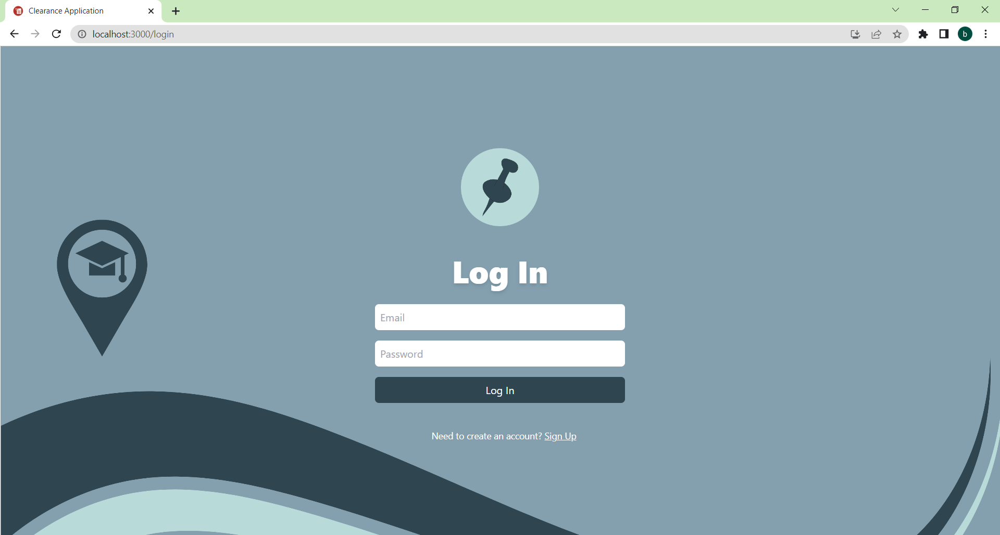
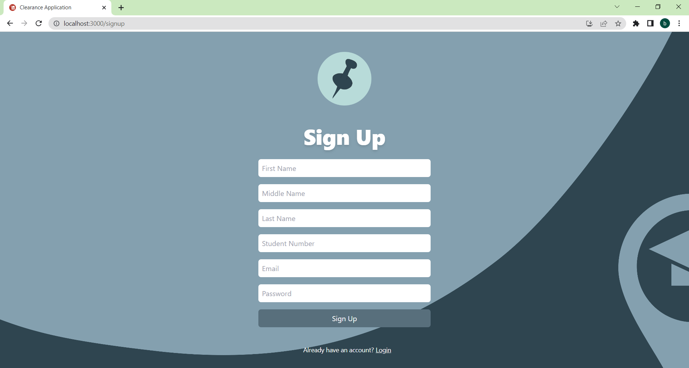
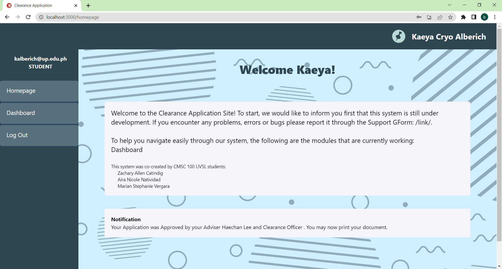
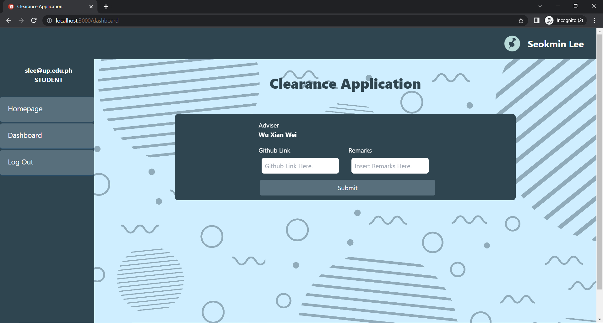
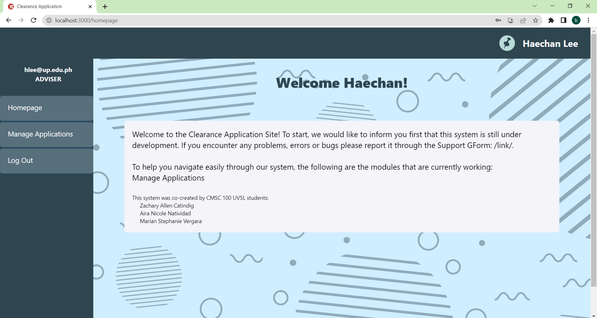
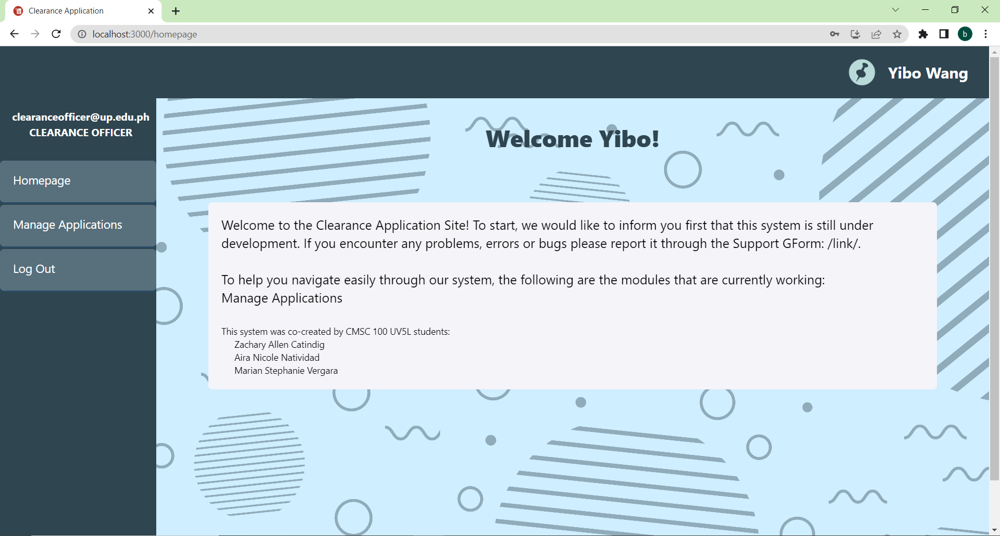
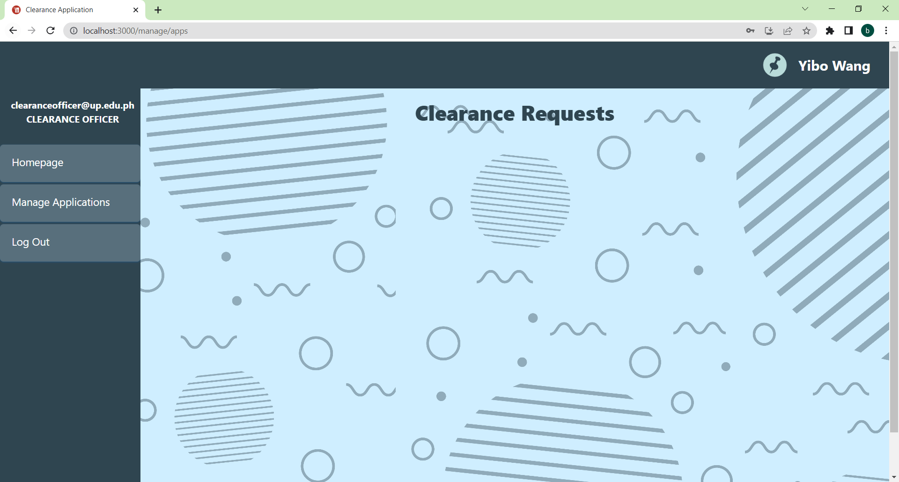
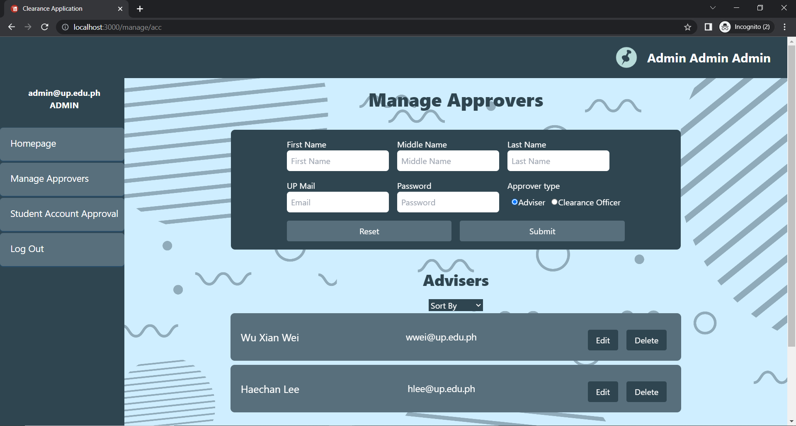
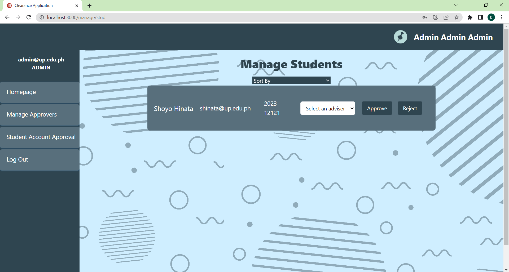

<h1 align="center">Clearance Application Site  📝</h1>  

  🖊️ A simple clearance application site built using ReactJS (+ CSS) and  MongoDB. 🖊️

  Zachary Allen Catindig
  Aira Nicole Natividad
  Marian Stephanie C. Vergara
️

##  Features:
- 📱 Log In & Sign Up Users
- 📱 Create and Account for Approver
- 📱 Manage Accounts for Students
- 📱 Students [Apply for Clearance]
- 📱 Users [Create, Approve, Reject]
- 📱 Clearance [Apply, Cancel, Print, Resubmit]
- 📱 Approvers [Approve, Reject, Add Remarks]
- 📱 Others [Notification for Status, Notification for succes/error, Sorting of students and approvers in admin]

## Screens: 

## Process: 
Using the laboratory template, the palette were changed as well as the fonts to style the site and make it aestheticallyt pleasing.
Fields for more information about the user were added for the Sign Up (First Name, Middle Name, Last Name, Student Number, Email, Password).
Validator was added to ensure non of the fields were left blank and to ensure that the format per text field was followed.
The Users, if students can now log in once account was approved by the admin. They can now submit an application for clearance to their adviser. Adviser were assigned by admins.
Approvers were created by admins.
After checking the clearance by the adviser, it will then be sent to the Clearance Officer. When cleared, the student will not be able to submit another application, when closed, the student will be prompted to submit a new one after fixing what was asked. 
A notification section on the Homepage reflects the status of the application of the student.

## How To Run: 
- download the file https://github.com/CMSC100/project-airanatividad.git
- extract the zip file 
- go inside the backend folder
- on the console, enter 'npm install' to install all dependencies
- on the console, enter 'npm start' to start the backend
- go inside the frontend folder
- on the console, enter 'npm install' to install all dependencies
- on the console, enter 'npm start' to start the frontend
- you may now start using the site